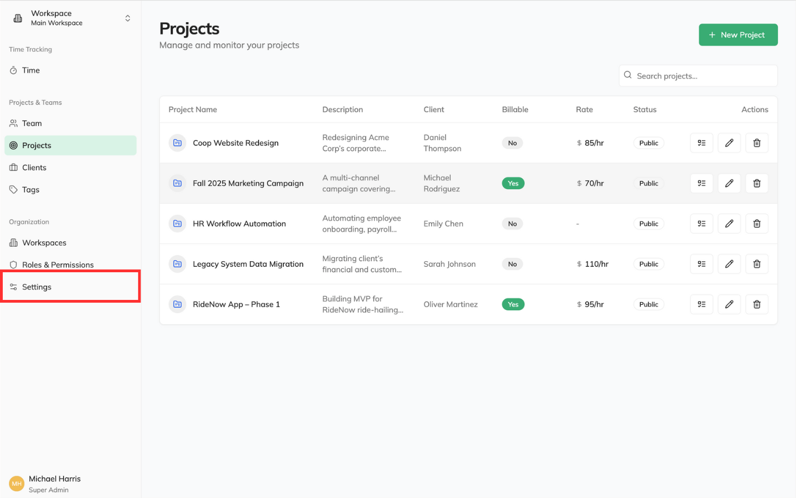
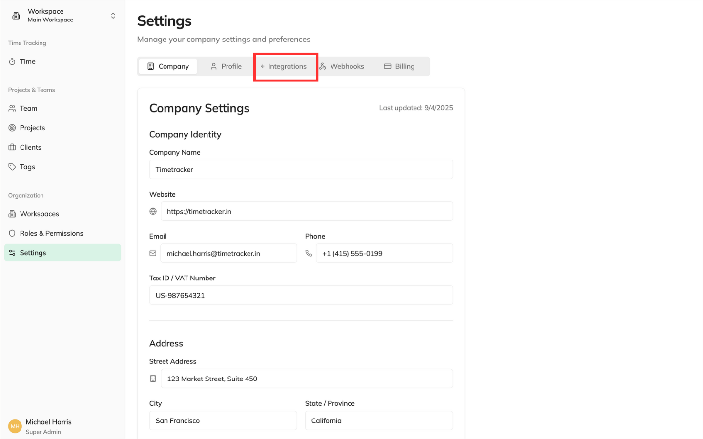
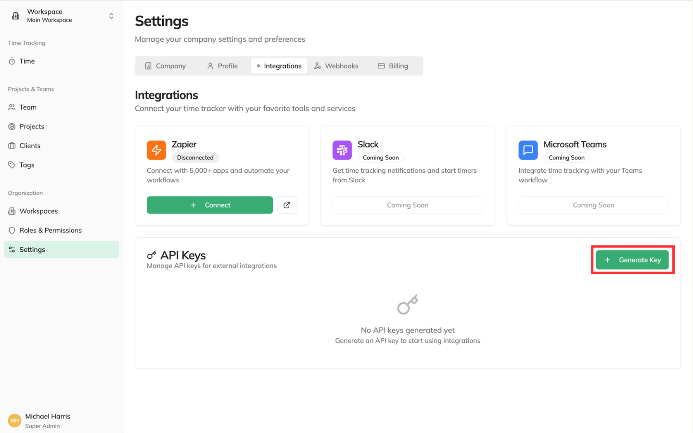
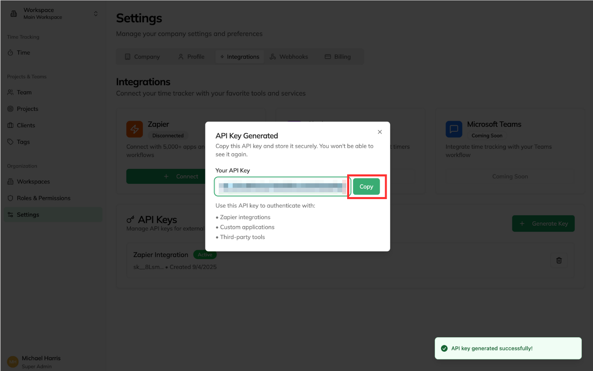
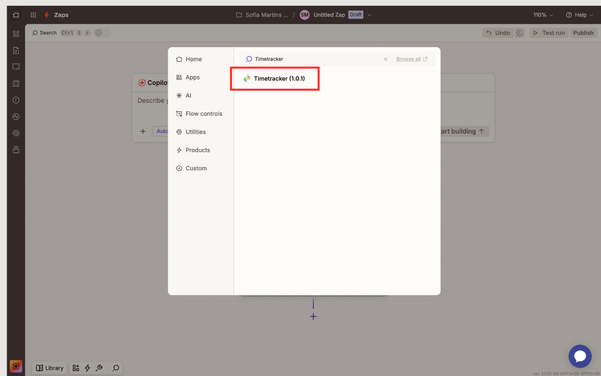
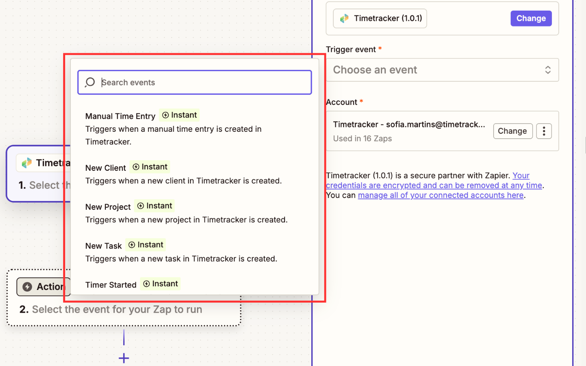
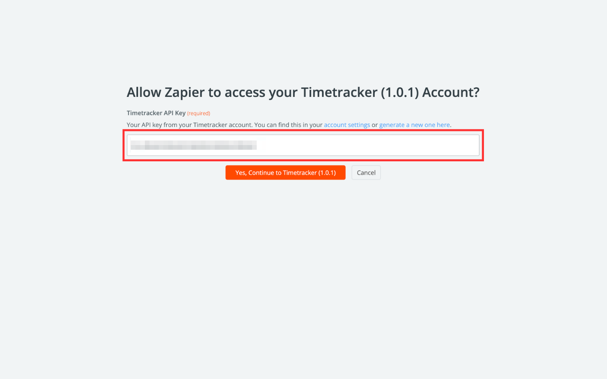

## Overview

To connect Zapier with your Timetracker account, you'll need to authenticate using an API key. This key provides secure access to your account data and allows Zapier to perform actions on your behalf.

<Info>
API keys are the recommended authentication method for server-to-server integrations like Zapier. They're more secure than username/password authentication and provide better control over access permissions.
</Info>

---

## Getting Your API Key

### Step 1: Access Your Account Settings

1. Log in to your [Timetracker account](https://app.timetracker.in)
2. Navigate to **Settings**
  
3. Click on the **Integrations** tab
  

### Step 2: Generate a New API Key

1. Click **Generate Key**
  
2. Click **Copy**
  

<Warning>
**Security Alert**: Your API key provides access to your account data. Never share it publicly, commit it to version control, or send it via unsecured channels.
</Warning>

### Step 3: Copy and Store Your Key

1. Copy the generated API key immediately
2. Store it securely in a password manager or secure note
3. The key will only be displayed once for security reasons

<Note>
If you lose your API key, you can always generate a new one. The old key will be automatically revoked when you create a replacement.
</Note>

---

## Connecting to Zapier

### Step 1: Add Timetracker to Your Zap

1. In Zapier, create a new Zap or edit an existing one
2. Search for **Timetracker** in the app directory
  
3. Select the trigger or action you want to use
  

### Step 2: Authenticate Your Account

1. Click **Connect an Account**
2. Choose **API Key** as the authentication method
3. Enter your API key in the **API Key** field
  
4. Click **Test Connection** to verify authentication

<Check>
**Success**: You'll see a green checkmark and "Connected" status when authentication is successful.
</Check>

### Step 3: Test Your Connection

1. Click **Test** to verify the connection works
2. Check that sample data is returned correctly
3. Review any error messages if the test fails

---

## Troubleshooting Authentication Issues

### Common Problems and Solutions

<AccordionGroup>
<Accordion title="Invalid API Key Error">
**Problem**: Zapier shows "Invalid API key" or "Authentication failed"

**Solutions**:
- Verify you copied the entire API key correctly
- Check that the key hasn't expired or been revoked
- Ensure there are no extra spaces or characters
- Try regenerating a new API key
</Accordion>

<Accordion title="Connection Timeout">
**Problem**: Zapier can't connect to Timetracker servers

**Solutions**:
- Check your internet connection
- Verify Timetracker service status
- Try again in a few minutes
- Contact support if the issue persists
</Accordion>
</AccordionGroup>

---

## Security Best Practices

### API Key Management

- **Store securely**: Use a password manager or secure vault
- **Rotate regularly**: Generate new keys every 90 days
- **Monitor usage**: Check your API key usage logs regularly
- **Revoke unused keys**: Delete keys you no longer need

<Warning>
**Important**: If you suspect your API key has been compromised, immediately revoke it and generate a new one. This will prevent unauthorized access to your account.
</Warning>

---

### Need Help?

- Contact support at support@timetracker.in
